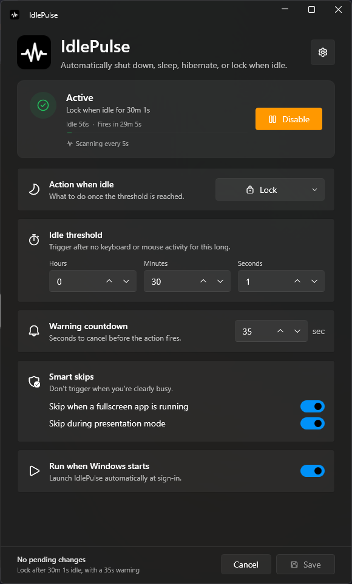
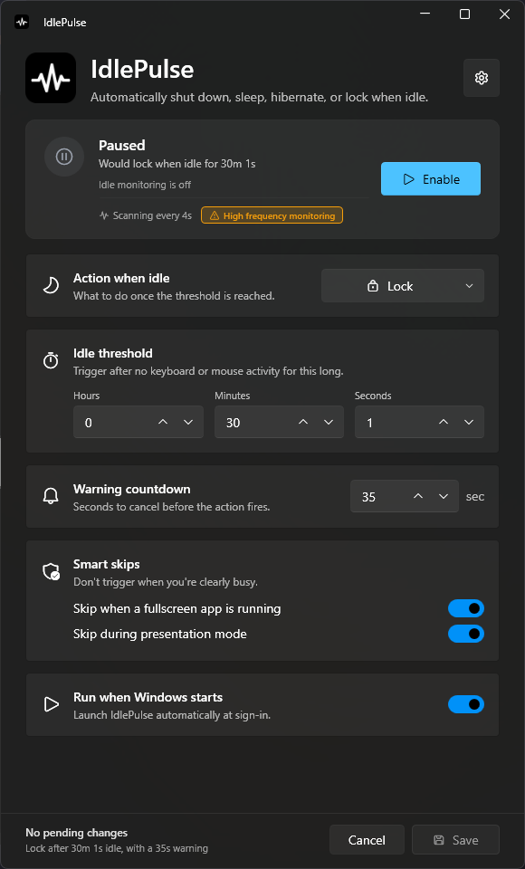
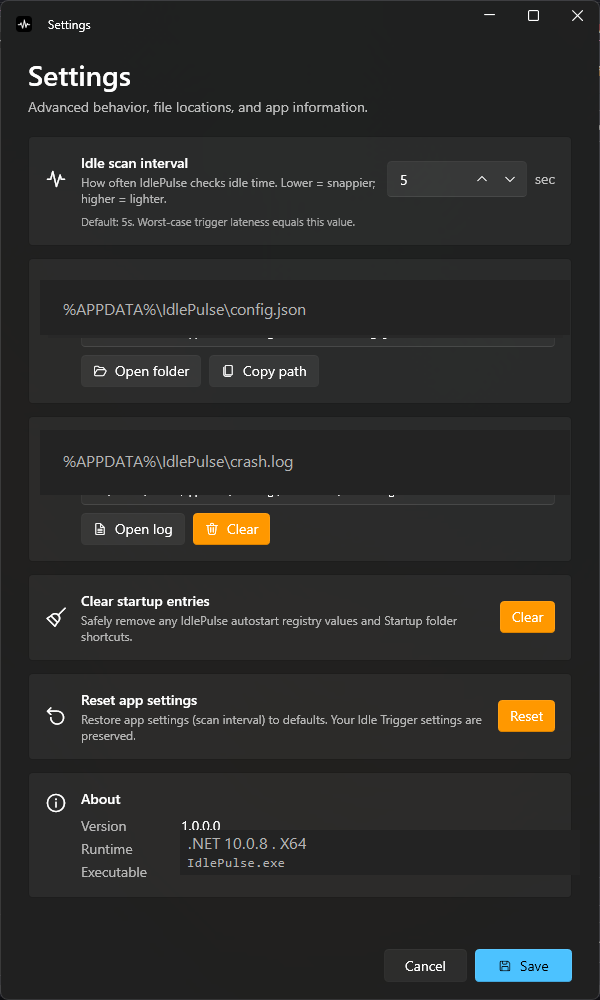

<div align="center">


# IdlePulse

**Auto-shutdown, sleep, hibernate, or lock your PC after inactivity — with a cancellable warning countdown.**

The clean idle-shutdown utility Windows didn't ship with.

[](https://www.microsoft.com/windows)
[](https://dotnet.microsoft.com/download/dotnet/10.0)
[](https://github.com/lepoco/wpfui)
[](https://learn.microsoft.com/dotnet/csharp/)
[](LICENSE)
[](https://github.com/TheCSir/IdlePulse/releases/latest)
[](https://github.com/TheCSir/IdlePulse/releases/latest)

[Download installer](https://github.com/TheCSir/IdlePulse/releases/latest) · [Portable exe](https://github.com/TheCSir/IdlePulse/releases/latest) · [Report a bug](https://github.com/TheCSir/IdlePulse/issues) · [Tech deep-dive](INFO.md)

</div>

---

## Why IdlePulse?

Windows can put your PC to **sleep** after a period of inactivity. It cannot **shut it down**. The only stock workaround is a 10-step Task Scheduler dance whose idle definition is unreliable enough to misfire after ~10 minutes when you asked for 2 hours.

IdlePulse fills that gap with a small Fluent-styled tray app. It uses the **same Win32 API Windows itself uses** for idle detection (`GetLastInputInfo`), polls at sub-second precision, and only ever fires when the user is genuinely away — never during fullscreen video, gaming, or presentations.

---

## Screenshots

<div align="center">

<table>
  <tr>
    <td align="center">
      <br/>
      <sub><b>Active — live idle tracking + progress bar</b></sub>
    </td>
    <td align="center">
      <br/>
      <sub><b>Paused — one click to re-enable</b></sub>
    </td>
  </tr>
  <tr>
    <td align="center" colspan="2">
      <br/>
      <sub><b>Settings — scan interval, file paths, crash log, startup cleanup</b></sub>
    </td>
  </tr>
</table>

</div>

---

## ✨ Features

<table>
  <tr>
    <td width="50%" valign="top">

### 🎯 Smart idle detection
- Same `GetLastInputInfo` Win32 API Windows uses
- Configurable scan interval (1s – 1h)
- High-frequency monitoring warning when scan < 5s

### 🛡️ Smart skips
- Pauses during fullscreen apps (games, video)
- Pauses during presentation mode
- Auto-resumes on session unlock with grace period

### 💾 Survive resume
- 1-minute cooldown after wake from sleep
- Won't immediately re-trigger when you come back

    </td>
    <td width="50%" valign="top">

### ⚡ Four idle actions
- **Shutdown** — graceful via `shutdown.exe`
- **Sleep** — `SetSuspendState` to RAM
- **Hibernate** — `SetSuspendState` to disk
- **Lock** — `LockWorkStation`

### ⏱️ Cancellable warning
- Topmost notification with progress ring
- Big Cancel button + animated countdown
- 5s – 30 min configurable

### 🎨 Modern Fluent UI
- Mica backdrop, dark theme, rounded corners
- Live status banner with progress bar
- Tray menu with live state header

    </td>
  </tr>
</table>

---

## 🚀 Install

### Option A — Installer (recommended)

[Download the latest `IdlePulse-Setup-X.Y.Z.exe` from Releases →](https://github.com/TheCSir/IdlePulse/releases/latest)

The installer:
- ✅ Lets you pick **per-user (no admin)** or **per-machine** at runtime
- ✅ Adds Start Menu (and optionally Desktop) shortcuts
- ✅ Optionally enables **Run at Windows startup**
- ✅ Optionally launches IdlePulse after install
- ✅ Registers a clean uninstall entry in Settings → Apps

### Option B — Portable

Grab `IdlePulse.exe` from `publish/` after building, or attach it from a release. Drop it anywhere and double-click — the tray icon appears bottom-right.

---

## 🧰 Tech stack

| Layer | Tech |
|---|---|
| Runtime | **.NET 10** (LTS, self-contained, single-file) |
| Language | **C# 14** |
| UI | **WPF** + **[WPF-UI 4.3](https://github.com/lepoco/wpfui)** (Fluent design — Mica, dark theme, rounded corners) |
| Tray icon | **[Hardcodet.NotifyIcon.Wpf](https://github.com/hardcodet/wpf-notifyicon)** |
| Idle / power APIs | **Win32 P/Invoke** — `GetLastInputInfo`, `SetSuspendState`, `LockWorkStation`, `SHQueryUserNotificationState` |
| Config | **`System.Text.Json`** at `%APPDATA%\IdlePulse\config.json` |
| Installer | **[Inno Setup 6+](https://jrsoftware.org/isinfo.php)** |
| Distribution | Single-file self-contained `.exe` (~75 MB) or Setup.exe (~70 MB) |

---

## 🛠️ Build from source

```powershell
# Requires .NET 10 SDK from https://dotnet.microsoft.com/download/dotnet/10.0
dotnet publish IdlePulse.csproj -c Release -o publish
```

Outputs a single self-contained `IdlePulse.exe` (~75 MB).

### Build the installer

Requires [Inno Setup 6.x or 7.x](https://jrsoftware.org/isinfo.php). The script auto-discovers `ISCC.exe`.

```powershell
powershell -ExecutionPolicy Bypass -File tools\build-installer.ps1
```

Output: `installer\dist\IdlePulse-Setup-<version>.exe`

---

## 📋 Requirements

- **OS:** Windows 10 (1809+) or Windows 11
- **Architecture:** x64
- **Runtime:** None — the published binary is self-contained

---

## 📂 Project layout

```
IdlePulse/
├── App.xaml(.cs)          # App entry, single-instance mutex, crash logger
├── TrayApp.cs             # Tray icon, context menu, lifecycle
├── Models/AppConfig.cs    # JSON-serializable config
├── Native/                # Win32 P/Invoke
├── Services/              # IdleMonitor, ConfigStore, PowerActionExecutor,
│                          # AutostartManager, Dialogs, Format
├── Views/                 # SettingsWindow, AppSettingsWindow, CountdownWindow
├── Assets/                # Icon (.ico) + 512px PNG for in-window display
├── installer/             # Inno Setup script
├── tools/                 # build-installer.ps1, generate-icon.ps1
└── docs/                  # screenshots/
```

For architecture, design decisions, performance notes, migration logic, and other deep-dives, see **[INFO.md](INFO.md)**.

---

## 📄 License

MIT — see [LICENSE](LICENSE).

---

<div align="center">

Built by <b><a href="https://github.com/TheCSir">TheCSir</a></b>

If IdlePulse saved you electricity, give the repo a ⭐

</div>
